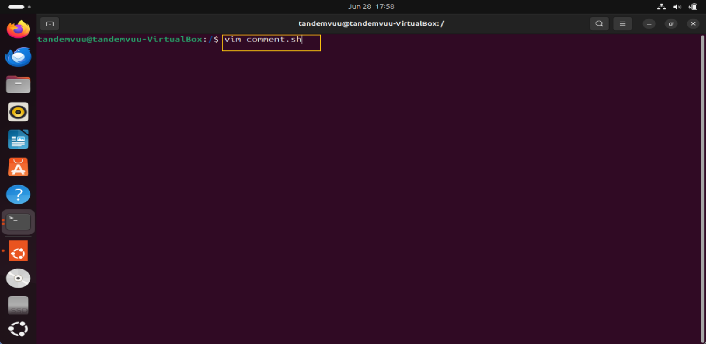
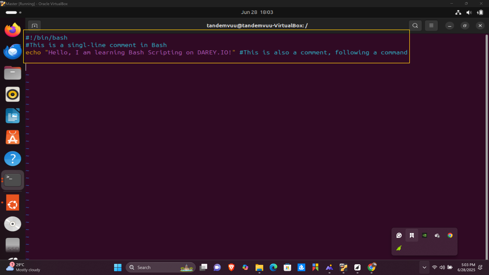
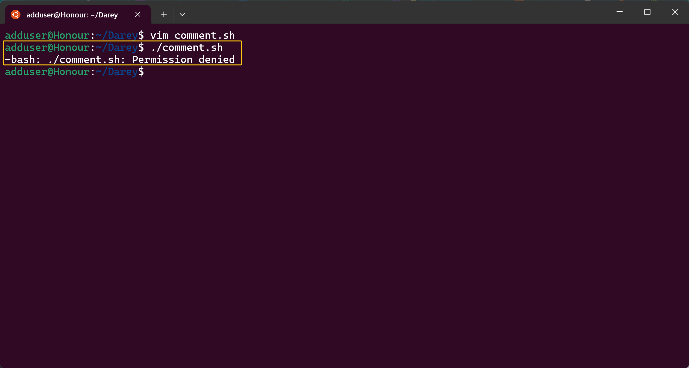
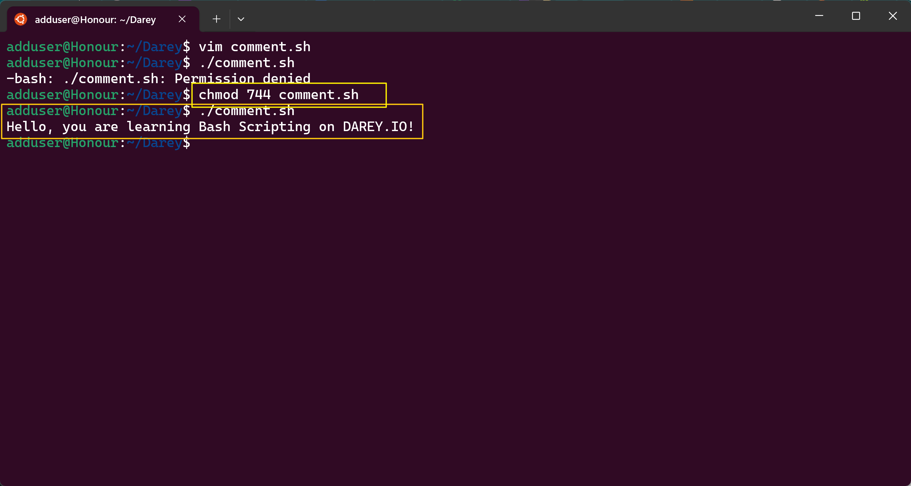
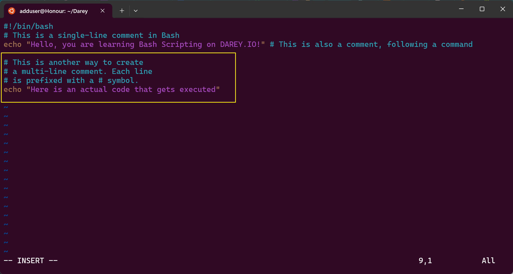
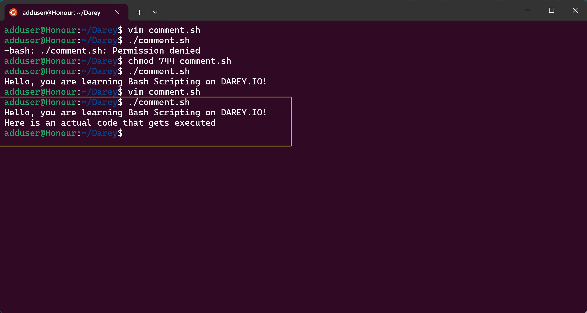
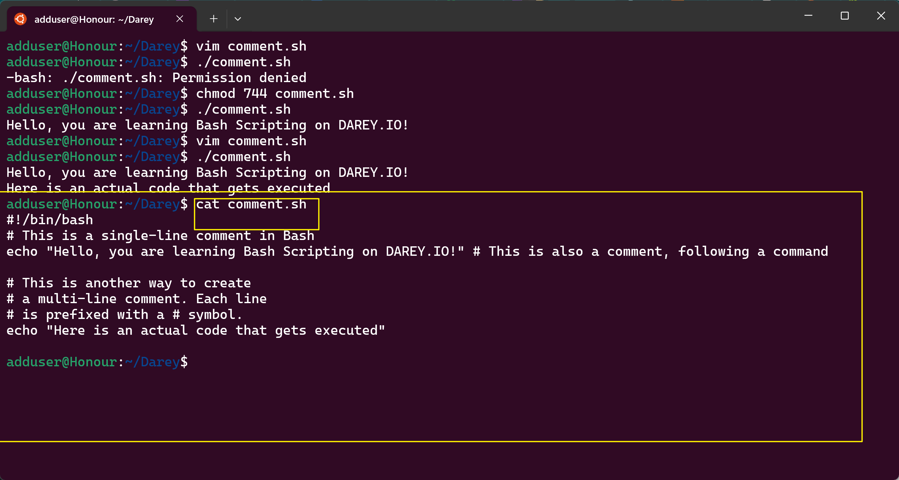

# How to Comment in Bash Scripts

This guide walks you through how to add comments in Bash scripts.

---

## 1. Create or Edit a Script

You can create a new script or edit an existing one using the `vim` text editor.

Run:
```bash
vim comment.sh
```


---

## 2. Add a Comment

Press `i` to enter insert mode. Add comments by starting a line with `#`.

Example:
```bash
#!/bin/bash
# This is a single-line comment in Bash
echo "Hello, you are learning Bash Scripting on DAREY.IO!" # This is also a comment, following a command
```


---

## 3. Save and Exit

- Press `Esc` to exit insert mode.
- Type `:wq` and press `Enter` to save and quit.

---

## 4. Give Execution Permission

Run:
```bash
chmod 744 comment.sh
```

---

## 5. Run the Script

Execute the script:
```bash
./comment.sh
```



---

## 6. Add Multi-line Comments

There is no special multi-line comment syntax in Bash. Prefix each line with `#`.

To edit the script again:
- Open with `vim comment.sh`
- Press `i` to enter insert mode, then paste:
```bash
# This is another way to create
# a multi-line comment. Each line
# is prefixed with a # symbol.
echo "Here is an actual code that gets executed"
```


- Press `Esc` and type `:wq` to save and exit.
- Run the script again:
  ```bash
  ./comment.sh
  ```


---

## 7. View the Script Contents

To see all contents of the file, use:
```bash
cat comment.sh
```


---

## License

This project is open source for educational purposes and open to contributions and advice.


