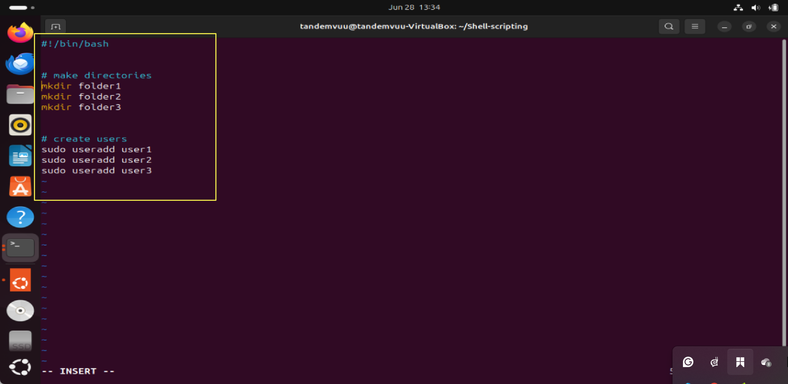

# Shell-scripting
Shell scripting guide
### step1 Create a folder
```bash
mkdir shell-scripting
```


### step2 create and use vim to edit
```bash
vim my_first_shell_script.sh
```


### step2 input following command 
```
#!/bin/bash

# Create directories
mkdir Folder1
mkdir Folder2
mkdir Folder3

# Create users
sudo useradd user1
sudo useradd user2
sudo useradd user3
```


press ESC key followed by :wq and press enter to save and exit.

 ### step3 The script is inside the  Shell-scripting folder
Use this commanand to check the file is created and the owner permission.
```bash
ls  -latr
```

Output

### execute the sript
```bash
./my_first_shell_script.sh
```

If you get 'permission denied'
### Use this command to add  execute permission to the owner;
```
chmod 700 my_first_script.sh
```


Run 
```bash
ls -latr
```
you will see that  the owner permission has been elevated to be able to execute the script.


### Now execute this script again, you should see successful.


enter user password


### To confirm if the files and users were created from our script;
for created folders
Run
```bash
ls
```


For created Users
Run:
```bash
id user1 user2 user3
```

For bash

### For sh
### Use vim to open the editor press i to enter insert mode paste this command
```bash
#!/bin/sh

# Create directories
mkdir Folder4
mkdir Folder5
mkdir Folder6

# Create users
sudo useradd user4
sudo useradd user5
sudo useradd user6
```


save and exit
### Execute the file again and verify with ls and id user4 to verify the execution. Using thesame process from the first step.


### How to use variable to retieve value
Run;
```bash
name="John"
```
```bash
echo $name
```
to explore more
```bash
echo My name is $name
```


# How to Comment in Bash Scripts

This guide walks you through how to add comments in Bash scripts.

---

## 1. Create or Edit a Script

You can create a new script or edit an existing one using the `vim` text editor.

Run:
```bash
vim comment.sh
```


---

## 2. Add a Comment

Press `i` to enter insert mode. Add comments by starting a line with `#`.

Example:
```bash
#!/bin/bash
# This is a single-line comment in Bash
echo "Hello, you are learning Bash Scripting on DAREY.IO!" # This is also a comment, following a command
```


---

## 3. Save and Exit

- Press `Esc` to exit insert mode.
- Type `:wq` and press `Enter` to save and quit.

---

## 4. Give Execution Permission

Run:
```bash
chmod 744 comment.sh
```

---

## 5. Run the Script

Execute the script:
```bash
./comment.sh
```


---

## 6. Add Multi-line Comments

There is no special multi-line comment syntax in Bash. Prefix each line with `#`.

To edit the script again:
- Open with `vim comment.sh`
- Press `i` to enter insert mode, then paste:
```bash
# This is another way to create
# a multi-line comment. Each line
# is prefixed with a # symbol.
echo "Here is an actual code that gets executed"
```


- Press `Esc` and type `:wq` to save and exit.
- Run the script again:
  ```bash
  ./comment.sh
  ```


---

## 7. View the Script Contents

To see all contents of the file, use:
```bash
cat comment.sh
```


---

## License

This project is open source for educational purposes and open to contributions and advice.


LICENSE
This project is opensource, your suggestions and comments are welcome!
