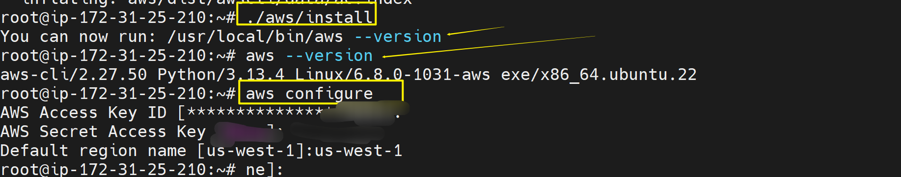

## S3 Bucket Automation Script

This Bash script automates the creation of S3 buckets for each department in my company.  
It uses a for loop to iterate over each department, checks if the bucket exists with `aws s3api head-bucket`, and creates it if it doesn't.  
Error handling is implemented by checking the exit code `$?` after attempting bucket creation.


###connect to EC2 instace.


### Install and configure aws cli
```
sudo apt update
sudo apt install awscli -y
```


```
sudo ./install -i /usr/local/aws -b /usr/local/bin/aws
```


```
cd ~
rm -rf awscli-bundle
curl "https://awscli.amazonaws.com/awscli-exe-linux-x86_64.zip" -o "awscliv2.zip"
unzip awscliv2.zip
sudo ./aws/install
```


##configure aws credentials




#### Use vim to create a file and Grant execution permission
```
chmod +x create_s3_bucket.sh
```


#### Editing the Script
#### Running the Script
```bash
vim create_s3_buckets.sh
```


### input Script Code

```
#!/bin/bash

# Function to create S3 buckets for different departments
create_s3_buckets() {
    company="bam-dowlib"  # Added unique prefix to avoid conflicts
    departments=("marketing" "sales" "hr" "operations" "media")
    region="us-west-1"  # Your specified region


    for department in "${departments[@]}"; do
        bucket_name="${company}-${department}-data-bucket"

        # Check if the bucket already exists
        if aws s3api head-bucket --bucket "$bucket_name" 2> head-bucket-error.log; then
            echo "S3 bucket '$bucket_name' already exists."
        else
            if [ -s head-bucket-error.log ]; then
                echo "Error checking bucket existence: $(cat head-bucket-error.log)"
            fi
            # Create S3 bucket with location constraint for us-west-1
            echo "Creating bucket '$bucket_name' in region $region"
            aws s3api create-bucket --bucket "$bucket_name" --region "$region" --create-bucket-configuration LocationConstraint="$region" 2> create-bucket-error.log
            if [ $? -eq 0 ]; then
                echo "S3 bucket '$bucket_name' created successfully."
            else
                echo "Failed to create S3 bucket '$bucket_name'."
                if [ -s create-bucket-error.log ]; then
                    echo "Error details: $(cat create-bucket-error.log)"
                fi
            fi
        fi
    done
}

# Call the function
create_s3_buckets

```


### Script Execution
#### Running the Script
```bash
./create_s3_buckets.sh
```


#### Verifying S3 Buckets on the aws console


# In this mini project, I learned how to automate the process of creating AWS S3 buckets for different departments within a company using a Bash script and the AWS CLI. By writing and executing the script, I improved my skills in Bash scripting, particularly in defining functions, working with arrays, and using for loops to efficiently handle multiple items. I also practiced using conditional statements to make the script smart enough to check if a bucket already exists before attempting to create it. Additionally, I gained hands-on experience managing file permissions, running scripts in the terminal, and troubleshooting potential errors. Documenting each step and capturing screenshots helped reinforce my understanding and gave me practical experience in technical documentation. Overall, this project boosted my confidence in shell scripting, AWS automation, and clear project reporting.
